# Hệ thống Stream Torrent - Bluesia Cinema

Tài liệu này tổng hợp toàn bộ kiến trúc, cấu hình chi tiết và các tối ưu hóa của tính năng **Stream Torrent từ PirateBay** tích hợp trong dự án **Next.js 15+ & Artplayer**. Bạn có thể đưa tài liệu này cho bất kỳ mô hình AI nào khác để tiếp tục phát triển mà không mất ngữ cảnh.

---

## 🗺️ 1. Sơ đồ Kiến trúc & Luồng hoạt động

```mermaid
sequenceDiagram
    actor User as Người dùng
    participant UI as Giao diện (TorrentVideo / Artplayer)
    participant API_Src as API Nguồn (/api/torrent/sources)
    participant API_Str as API Stream (/api/torrent/stream)
    participant Engine as Torrent Engine (lib/torrent-engine.ts)
    participant P2P as Mạng lưới Torrent (Seeders)

    User->>UI: Chọn link phim từ danh sách PirateBay
    UI->>API_Str: Gửi yêu cầu HTTP Range (Range: bytes=0-)
    API_Str->>Engine: Khởi tạo/Lấy engine thông qua magnet hash
    Engine->>P2P: Kết nối peers, bắt đầu kéo siêu dữ liệu (metadata)
    Engine-->>API_Str: Sẵn sàng và trả về thực thể File
    
    rect rgb(20, 20, 30)
        note right of API_Str: Thực hiện Kỹ thuật Chunking (Giới hạn tối đa 500MB/yêu cầu)
        API_Str->>Engine: Đọc Stream dữ liệu (start -> end: 500MB)
        Engine->>P2P: Tải mảnh (pieces) tương ứng từ các Seeders
        Engine-->>API_Str: Trả về luồng nhị phân (Web ReadableStream)
        API_Str-->>UI: Response HTTP 206 (Partial Content)
    end

    UI->>User: Artplayer nhận luồng dữ liệu & phát mượt mà
```



---

## 🛠️ 2. Các thành phần Core & Mã nguồn liên quan

### 📂 A. Lớp Lõi Torrent Engine (`lib/torrent-engine.ts`)
*   **Công nghệ:** Sử dụng thư viện `torrent-stream` (đã được cấu hình trong `next.config.mjs` để Node.js server nhận dạng gói bên ngoài).
*   **Cơ chế Cache:** Giữ file cache trong thư mục tạm (`os.tmpdir()/torrents`) với thời gian sống **6 giờ** (`CACHE_LIFETIME`). Quét dọn tự động mỗi **1 giờ** (`CLEANUP_INTERVAL`).
*   **Bảo vệ Băng thông & Tốc độ tối đa:**
    *   `connections: 100` (Max Connections): Cho phép kết nối tối đa 100 peers cùng lúc để đạt tốc độ tải tốt nhất.
    *   `uploads: 0` (No Seeding): Khóa hoàn toàn chức năng upload ngược lại mạng P2P quốc tế để **tiết kiệm 100% băng thông tải lên** vô ích của VPS.
*   **Cơ chế Idle Timeout (Tự động tắt nguồn tải ngầm):**
    *   Khi trình duyệt đóng hoặc chuyển trang, luồng stream sẽ ngắt kết nối (`close`/`end`).
    *   Hệ thống sẽ đếm ngược **5 phút**. Nếu sau 5 phút không có bất kỳ luồng nào xem tiếp, VPS sẽ tự động **Hủy Engine (Destroy)** và xóa thực thể trong RAM. Việc này ngăn chặn hoàn toàn việc VPS tiếp tục cắm đầu tải ngầm file 12GB khi người dùng đã bỏ đi.

### 📂 B. Smart Chunked Streaming (`app/api/torrent/stream/route.ts`)
*   **Giao thức:** Hỗ trợ HTTP Range Requests (`status: 206 Partial Content`).
*   **HTTP Range Chunking (Giới hạn Chunk Size):**
    *   Để tránh việc trình duyệt tự động yêu cầu tải hết file 12GB ngay từ đầu, API này ép cứng tham số `MAX_CHUNK_SIZE = 500MB`.
    *   Mỗi khi trình duyệt yêu cầu buffer, máy chủ chỉ phản hồi tối đa **500MB dữ liệu**. Xem hết 500MB trình duyệt sẽ tự động xin tiếp.
    *   Giúp VPS tải phim theo kiểu "tới đâu tải tới đó" (đồng bộ với thanh buffer của người dùng), chặn đứng việc phí phạm băng thông traffic chất lượng cao.

### 📂 C. Bộ lọc Nguồn PirateBay (`app/api/torrent/sources/route.ts`)
*   **Đường dẫn:** `/api/torrent/sources?q=[tên_phim]&source=piratebay`
*   **Bộ lọc Chất lượng nghiêm ngặt:** 
    *   Chỉ hiển thị các kết quả có chứa chữ `720p` hoặc `1080p` trong tên torrent (để loại bỏ các bản CAM, TS, WEB-DL 4K, v.v.).
    *   **Bỏ giới hạn dung lượng:** Cho phép tải tất cả các bản phim nét căng (bao gồm cả các phim Bluray/REMUX nặng đến **12GB**).

### 📂 D. Quản lý Phụ đề Subdl API (`lib/subdl.ts` & `app/api/subtitles/proxy/route.ts`)
*   **Tích hợp API:** Sử dụng API của Subdl để tự động tìm kiếm phụ đề tương ứng với `imdb_id` hoặc tên phim.
*   **Proxy CORS:** Phụ đề được fetch thông qua Proxy của server để tránh lỗi Cross-Origin (CORS) trên trình duyệt.
*   **API Key:** Đọc biến môi trường `SUBDL_API_KEY` cấu hình trong `.env.local` (`8v9_qOTpML3uhnxP1_G4TI0ne4z1PvQY`).

### 📂 E. Trình phát Video Artplayer (`components/TorrentVideo.tsx`)
*   **Khắc phục lỗi Type Error:** Sửa triệt để lỗi Next.js crash khi truyền `subtitle: undefined` vào Artplayer. Thay vào đó, Artplayer Options sẽ được khởi tạo động, chỉ gán thuộc tính `subtitle` khi mảng phụ đề từ API Proxy có dữ liệu.
*   **Trải nghiệm người dùng cực tốt:**
    *   Giao diện kết nối: Hiển thị overlay sang xịn mịn "Đang kết nối Torrent Engine..." cùng nút **Thử lại** nếu quá 30 giây không kết nối được seeder.
    *   Tích hợp menu chọn phụ đề động từ nguồn Subdl.
    *   Hỗ trợ tải phụ đề thủ công từ máy tính (`.srt`, `.vtt`, `.ass`).

---

## ⚡ 3. Biến môi trường & Cấu hình cần thiết khi mang đi

### File `.env.local`
Phải khai báo API key của Subdl trên môi trường phát triển cục bộ và trên VPS:
```env
SUBDL_API_KEY=8v9_qOTpML3uhnxP1_G4TI0ne4z1PvQY
```

### File `next.config.mjs`
Cần đảm bảo file `next.config.mjs` có thiết lập loại trừ gói `torrent-stream` ra khỏi bundle client để chạy mượt mà ở phía server:
```javascript
/** @type {import('next').NextConfig} */
const nextConfig = {
  serverExternalPackages: ["torrent-stream"],
  // Các cấu hình khác...
};
export default nextConfig;
```

---

## 🚀 4. Hướng dẫn Test nhanh trên môi trường mới

1. Khởi động môi trường phát triển:
   ```bash
   npm run dev
   ```
2. Mở trình duyệt truy cập một trang phim có tích hợp Torrent:
   `http://localhost:3000/movie/khu-rung-than-bi`
3. Cuộn xuống phần **Xem bản quốc tế (Torrent)**, chọn nguồn phim từ **PirateBay**.
4. Trình phát **Artplayer** sẽ xuất hiện, tự động tải phụ đề (nếu có) và bắt đầu stream phim mượt mà.
5. Để kiểm tra tính năng **Idle Timeout**, hãy bấm tắt tab xem phim và theo dõi log terminal của server: sau **5 phút**, hệ thống sẽ in ra dòng log:
   `[TorrentEngine] Destroyed idle engine: [magnet_hash]` nhằm báo hiệu tài nguyên đã được giải phóng thành công!

---

*Tài liệu này được biên soạn đầy đủ cấu hình hiện tại của dự án Bluesia Cinema nhằm phục vụ cho mục đích chuyển giao phát triển.*
